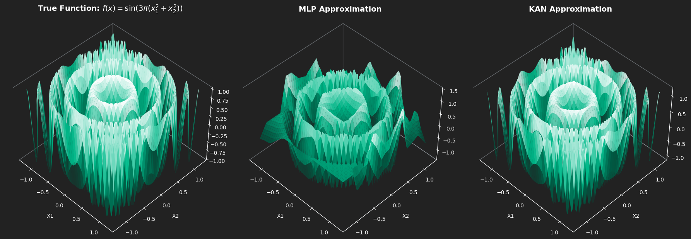
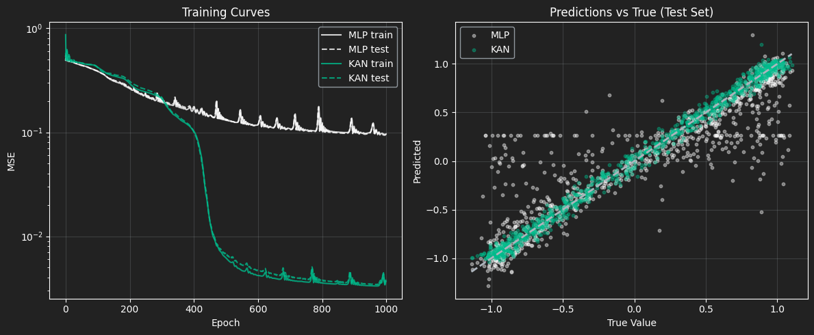

<div style="height: 40px;"></div>

## Background and Introduction

> Exploring the power of Kolmogorov-Arnold Networks for smarter, sharper function approximation.


Welcome to our first newsletter! We’ll start with a bit of background on the math and architecture behind KANs, then go through a KAN implementation. The GitHub repo for everything is linked at the end of the article. Along the way, we’ll share some interesting empirical results and try to build an intuition for how it all works. Hope you enjoy it!

___

**The MLP architecture and limitations**  
Standard multi-layer perceptrons (MLPs) place fixed activation functions (ReLU, SiLU, etc.) *inside the nodes*. Linear transformations (weights) live on the *edges*. This architecture forces the network to approximate any target function by stitching together many global hyperplanes. This is an approach that works but is extremely parameter-inefficient for smooth, high-frequency, or compositional functions (eg. $f(g(x))$).

**The KAN architecture and applications**  
KANs generated significant excitement in the ML community around 2024, as researchers recognized their potential to drastically improve function representation with fewer parameters and more interpretable structure. The hype was fueled by early benchmarks showing remarkably efficient interpolation, sparking interest in both theoretical exploration and practical applications.

Kolmogorov-Arnold Networks (KANs) achieve this by mitigating key limitations of traditional neural architectures. They eliminate fixed node activations entirely: every edge becomes a learnable univariate function φ, and every node simply sums its incoming signals. The entire network is thus a composition of univariate functions and summations, precisely the structure promised by the famous Kolmogorov-Arnold representation theorem.

## Unpacking the Theorem

The Kolmogorov-Arnold representation theorem (refined in the 1960s) states that any continuous multivariate function $f: [0,1]^n \to \mathbb{R}$ can be written as:

$$f(\mathbf{x}) = \sum_{q=1}^{2n+1} \Phi_q \left( \sum_{p=1}^n \phi_{q,p}(x_p) \right)$$

That’s a fantastic guarantee, but throwing raw equations at a problem doesn’t help us write code. To make this useful, we need to map the math directly to a network architecture.

- Inner edges $\phi_{q,p}(x_p)$: Instead of mixing inputs right away like in an MLP, each input ($x_p$) is first passed through its own separate 1D function, completely independent of the others.

- Intermediate nodes $\sum_{p=1}^n$: After that, the transformed inputs are just added together. No activation here, just a sum.

- Outer edges $\Phi_q$: So how do we capture interactions like $x_1 \cdot x_2$ if we only add things? That happens here. A final nonlinear 1D function is applied to the sum, which lets the model represent those interactions.

- Hidden dimension $2n+1$: This is the key guarantee. With $n$ inputs, you only need $2n+1$ of these nodes to represent any continuous function (e.g., 5 nodes for 2D input).

## Architectural Intuition

```{mermaid}
%%{init: {
  "theme": "base",
  "themeVariables": {
    "background": "#222222",
    "primaryColor": "#2d2d2d",
    "primaryBorderColor": "#00bc8c",
    "primaryTextColor": "#ffffff",
    "secondaryColor": "#2d2d2d",
    "tertiaryColor": "#2d2d2d",
    "lineColor": "#00bc8c",
    "edgeLabelBackground": "#222222",
    "clusterBkg": "#2d2d2d",
    "clusterBorder": "#00bc8c",
    "titleColor": "#adb5bd",
    "fontFamily": "Source Sans Pro, Lato, sans-serif",
    "fontSize": "14px"
  },
  "flowchart": {"curve": "basis", "rankSpacing": 85, "nodeSpacing": 105}
}}%%
graph LR
    %% Define Nodes
    x1["x₁"]
    x2["x₂"]
    
    %% Connections from x1
    x1 -->|"φ₁,₁(x₁)"| H1["Σ₁#160;"]
    x1 -->|"φ₂,₁(x₁)"| H2["Σ₂#160;"]
    x1 -->|"φ₃,₁(x₁)"| H3["Σ₃#160;"]
    
    %% Connections from x2
    x2 -->|"φ₁,₂(x₂)"| H1
    x2 -->|"φ₂,₂(x₂)"| H2
    x2 -->|"φ₃,₂(x₂)"| H3
    
    %% Connections to Output
    H1 -->|"Φ₁(Σ₁)#160;"| OUT["f(x) (Σ)"]
    H2 -->|"Φ₂(Σ₂)#160;"| OUT
    H3 -->|"Φ₃(Σ₃)#160;"| OUT
    
    %% Subgraphs
    subgraph IN["Inputs (n)"]
        x1
        x2
    end
    
    subgraph L1["Inner sums (2n+1)"]
        H1
        H2
        H3
    end
    
    subgraph OUT_G["Final output"]
        OUT
    end
```
Note: This graph shows a Kolmogorov–Arnold Network (KAN) for $(n=2)$, using three inner nodes for clarity instead of the $2n+1$ required by the theorem.

> $x_i$ (Inputs) : 
> The initial input features fed into the network.

> $\phi$ (Edges) : 
>The defining feature of a KAN. Instead of static weights ($w$), edges contain learnable univariate functions (e.g., B-splines).

>$\sum \phi(x)$ (Nodes) : 
>Nodes simply sum incoming signals. That means no activation, just aggregating the signals!

>$f(x)$ (Output) : 
>The final multivariate function built from compositions of 1D functions.

<br>

## Why KANs Matter
The Kolmogorov-Arnold theorem has been around since the 1950s. What changed is that we can now learn those univariate functions end-to-end with gradient descent, effectively turning a theoretical existence proof into a working architecture.

**Where KANs shine**

- **Scientific discovery and symbolic regression.** Each edge is a univariate function, so you can prune the network and literally read off the learned expression, i.e. "this edge learned $x²$, that one learned $sin(3πx)$." For physics, chemistry, and biology, that could be the foundation for new discoveries!

- **Physics and PDE solvers.** KANs respect compositional structure naturally, so they extrapolate far better than MLPs when solving differential equations outside the training domain.

- **High-frequency and periodic phenomena.** As the radial sine ripple demo will show later, KANs (especially SIREN-KAN variants) can capture rapid oscillations with far fewer parameters.

- **Low-to-medium dimensional problems.** Financial time series, engineering simulations, control systems. Tasks with roughly 2–20 input dimensions, where interpretability and reliable extrapolation are important.

<br>
**They have been hyped, but is it justified?**

MLPs approximate complex surfaces by overlapping vast numbers of flat hyperplanes. KANs follow the exact decomposition that the theorem guarantees exists, which gives them real structural advantages: often 10–100× fewer parameters on smooth functions, better out-of-distribution behavior, and interpretable edges you can inspect or symbolically regress.

MLPs are excellent for messy, high-dimensional data like images and text. KANs on the other hand are what you should apply when you suspect there's an underlying mathematical law to be found. 

## SIREN-KAN
The **[original KAN paper (Liu et al., 2024)](https://arxiv.org/abs/2404.19756)** parameterised the univariate edge functions $\phi$ with B-splines. This choice gives excellent localisation and interpretability, but B-splines struggle with high-frequency oscillations (which is what we are going to be testing here!) because they are inherently low-pass (smooth polynomial pieces).

When people replace B-splines with tiny MLPs (a common simplification in early re-implementations), the network inherits the spectral bias of standard MLPs and fails to capture rapid oscillations.

<br>
**The SIREN-KAN solution**

In this implementation we will replace the activation inside each edge with a SIREN-style periodic basis: $sin(\omega_0 x + b)$. By scaling the first-layer frequencies with $\omega_0$ and using careful initialisation, each univariate edge gains infinite periodic capacity. The result is a network that can learn the exact algebraic structure of high-frequency targets (e.g. sin(polynomial)) with dramatically fewer parameters.

## (Pseudo-) Code overview 

This is the rough KAN architecture:

```python
# full repo is separate (see bottom)

for layer in KAN_layers:
    
    # Inner univariate functions (one per edge)
    for every input_dim → hidden_dim edge:
        φ = sin(ω₀·x + b)               # SIREN-style
        edge_out = linear(φ)            # small projection
    h = sum(edge_out over input_dim)    # node sums
    
    # Outer univariate functions
    for every hidden_dim → out_dim edge:
        Φ = sin(ω₀·h + b)
        edge_out = linear(Φ)
    y = sum(edge_out over hidden_dim)
```

## The Stress Test: High-Frequency Radial Ripples

Target function (chosen to be analytically simple yet extremely difficult for spectral-biased networks):
$$
f(x_1, x_2) = \sin\bigl(3\pi(x_1^2 + x_2^2)\bigr)
$$

This is a radially symmetric sine wave whose frequency increases quadratically with distance from the origin, basically a perfect stress test for extrapolation.


## Experimental Setup

To rigorously evaluate whether these architectures actually learn the underlying mathematical rules, we analyzed performance within the training domain and also conducted a strict out-of-distribution (OOD) extrapolation test.

- **The Competitors:** A standard Multi-Layer Perceptron (two 64-neuron hidden layers, ~4,400 parameters) relying on global hyperplanes, matched against our custom SIREN-KAN (hidden dimension of 5, ~375 parameters) equipped with localized, frequency-scaled sine activations.
    
- **The Training Domain (Interpolation):** Both models were trained exclusively on uniformly sampled data within the boundary $x_1, x_2 \in [-1.2, 1.2]$. This provides a solid, bounded view of the central concentric ripples.
    
- **The Testing Domain (Extrapolation):** We then evaluated their predictive power on an expanded grid spanning $[-1.4, 1.4]$.
    
Why it matters: Neural networks are usually great at interpolating, but extrapolating? Not so much. If a network just memorizes the space by patching together overlapping linear segments (like a standard MLP), its predictions will fall apart as soon as you move past the $1.2$ boundary.

On the other hand, if a network’s inductive bias really captures the underlying periodic pattern, the exact boundary shouldn’t matter. Our hypothesis was that the KAN would handle this out-of-domain prediction much better.


## Results

{#fig-surfaces width=100% fig-align="center"}

The MLP shows a clear spectral bias: it handles the low-frequency, broad patterns near the origin pretty well, but completely misses the high-frequency details at the edges. The KAN, on the other hand, is much more expressive for this kind of problem, capturing both the coarse structure and the fine oscillations across the whole space.

{#fig-surfaces width=100% fig-align="center"}


**Training Dynamics (Left):**

You can pretty clearly see the MLP struggling during training. It hits a plateau early and then keeps spiking all over the place, which is a classic sign that the optimizer is fighting itself trying to fit high-frequency signals with a rigid structure. The KAN, on the other hand, is much smoother. Around epoch ~450 it actually breaks through that plateau and keeps improving, ending up at a much lower MSE.

**Prediction Fidelity (Right):**

The scatter plot makes it even more obvious. The KAN predictions sit right around the dashed “perfect prediction” line across the whole range. The MLP is way more scattered. You can even see these horizontal bands (especially around y ≈ 0.25), which indicates that it has basically given up and is predicting constant values over big chunks of the input space. It’s not clearly capturing the structure of the data as well as the KAN.

## Final Comparison

| **Architecture** | **Parameters** | **In-Distribution MSE $[-1.2, 1.2]$** | **OOD MSE ($> \lvert 1.2 \rvert$)** |
| ---------------- | -------------- | ------------------------------- | ----------------------- |
| **MLP (64x64)**  | 4,417          | 0.1063                          | 1.8749
| **SIREN-KAN**    | 375            | 0.0014                        |   0.2929                 |

<br>

**Interpolation:** 

Within the training domain, the Kolmogorov-Arnold Network performs exceptionally well. It achieved a near-perfect MSE of 0.0014 compared to the MLP's 0.1063, a 98.7% reduction in error. It achieves this while using roughly 12x fewer parameters, proving that its periodic 1D edges natively capture high-frequency ripples far better than the MLP's overlapping global hyperplanes.

**Extrapolation:** 

The out-of-distribution test reveals the true power of the architecture's inductive bias. The MLP fails catastrophically (MSE 1.87). Because it merely memorized the spatial grid, it runs out of hyperplanes past the 1.2 boundary and predicts chaotic noise.

The SIREN-KAN, however, successfully holds its structural integrity outside the training bounds (MSE 0.29). By deeply converging on the correct phase alignments of its internal sine waves, it managed to parameterize the periodic-quadratic structure well enough to accurately project the ripples into unseen space.
<br>

## A note on initialization

Normal networks "play it safe" and start with tiny weights to keep training stable. But in this case, a sine wave is basically flat around zero. Feed in tiny weights, and every sine in the network acts like a straight line. Your flexible KAN “flatlines” and loses all ability to bend around the data.

**The Fix:**

Borrowing a trick from SIRENs, we amplify the first layer’s weights, say 10×. This pushes signals out of the flat zone and forces the network to hit sine peaks and valleys from Epoch 0.

**The Trade-off:** 

A hypersensitive, oscillating landscape means learning rates must be precise, if they are too high, the optimizer will most likely bounce away. SIREN-KANs are extremely powerful, but far less forgiving than standard MLPs in this regard. So we had to initialize them multiple times before achieving a good representation!

## Conclusion and When to Use a KAN

Kolmogorov–Arnold Networks actually feel like a different way of thinking about neural networks. Instead of relying on rigid hyperplanes, they learn flexible one-dimensional functions, which lines up nicely with the Kolmogorov–Arnold theorem. In practice, that means better accuracy, far fewer parameters, and models that are easier to interpret.

The radial ripple experiment makes this pretty clear: about 12× fewer parameters, almost perfect interpolation, and much more stable behavior outside the training range, where a standard MLP tends to fall apart. That’s the core reason KANs (and SIREN-style variants) are getting so much attention.

___ 

**Final recommendation - Use a KAN when:**

- You need parameter-efficient approximation of smooth, highly compositional, or periodic physical/symbolic equations.

- Interpretability matters — *pruning* the univariate functions yields human-readable symbolic expressions!

- You are operating in low-to-medium input dimensionality $(n \lesssim 20)$.

**Do NOT use a KAN when**

- Input dimensionality is extreme (raw images, text tokens, etc.). The (2n+1) inner-sum expansion becomes a computational bottleneck and standard Transformers or MLPs still dominate here.

___

Easiest way to see how it works is to clone the repo!

> Full reproducible notebook → [manswestman/KAN-basics](https://github.com/manswestman/KAN-basics)